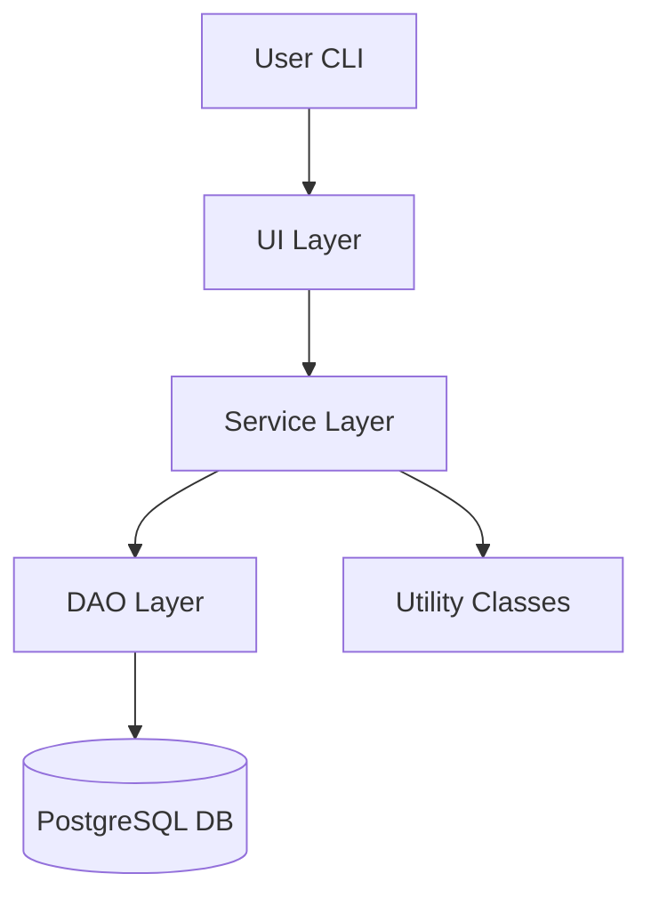
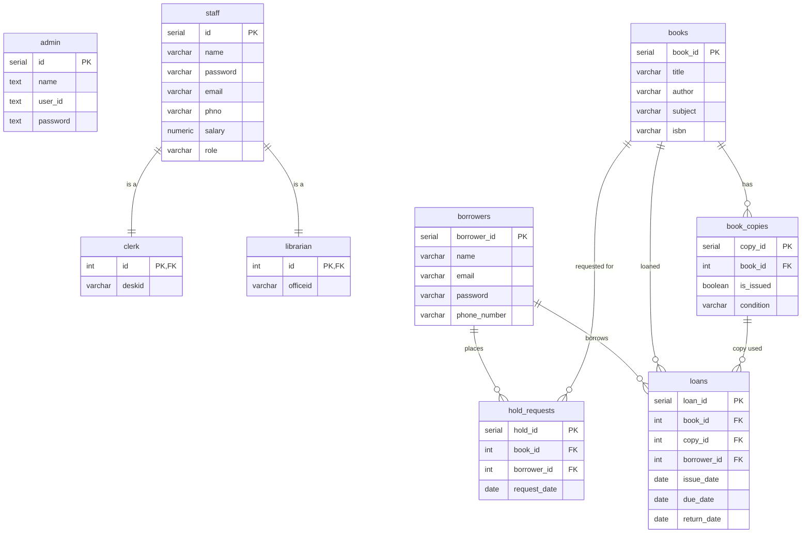

<p align="center">  </p>

# 📚 Library Management System – CLI Application Documentation

## Badges

<!-- Language & Tech -->


<!-- Build & Tooling -->


<!-- Project Info -->


<!-- Environment -->


## Overview

This project is a full-featured Library Management System (LMS) built as a Command-Line Interface (CLI) application using Java, JDBC, and PostgreSQL.

The LMS supports multiple user roles, including:

Admin

Librarian

Staff

Borrower

The system manages books, loans, requests, fines, holds, and user accounts with a clean DAO → Service → UI architecture.

## 📌 Features

### 👨‍💼 Admin
- Manage staff & librarians  
- View system reports  
- Full control over library operations  

### 📚 Book Management
- Add / Update / Delete books  
- Search by title, author, subject, ISBN  
- Track availability  

### 🧑‍🤝‍🧑 Borrower Management
- Register borrower  
- Update borrower info  
- View borrower history  

### 📖 Loan Management
- Issue books  
- Return books  
- Auto-calculate late fees  
- Track overdue items  

### 📝 Request & Hold Management
- Borrower can request books  
- Staff processes holds  
- Automated hold queue  

### 💰 Fine System
- Daily fine calculation  
- Track fine history  
- Fine payment handling  

### 📊 Reports
- Issued books  
- Loan summaries  


## Technologies Used

* **Java 17+**
* **PostgreSQL**
* **JDBC**
* **Maven / Gradle / IDE Build Tools**

## PostgreSQL JDBC Dependency

### ▶ For Maven users:

```xml
<dependency>
    <groupId>org.postgresql</groupId>
    <artifactId>postgresql</artifactId>
    <version>42.7.2</version>
</dependency>
```

### ▶ For Gradle users:

```gradle
dependencies {
    implementation 'org.postgresql:postgresql:42.7.2'
}
```

### ▶ For IntelliJ / Manual Setup:

Download the JDBC driver manually:

🔗 [https://jdbc.postgresql.org/download/](https://jdbc.postgresql.org/download/)

Add the `.jar` file to your project:

```
File → Project Structure → Modules → Dependencies → + Add JAR
```

## Architecture Diagram (Mermaid)

* **Java 17+**
* **PostgreSQL**
* **JDBC**
* **Maven / IDE Build Tools**

## Architecture Diagram (Mermaid)



## Project Structure

```
src/
│
├── entity/
│   ├── Book.java
│   ├── Loan.java
│   ├── Borrower.java
│   ├── Staff.java
│   ├── Person.java
│   └── HoldRequest.java
│
├── dao/
│   ├── BookDAO.java
│   ├── LoanDAO.java
│   ├── UserDAO.java
│   ├── StaffDAO.java
│   └── AdminDAO.java
│
├── service/
│   ├── BookService.java
│   ├── LoanService.java
│   ├── UserService.java
│   └── StaffService.java
│
├── ui/
│   ├── AdminInterface.java
│   ├── LibrarianInterface.java
│   ├── StaffInterface.java
│   └── UserInterface.java
│
└── util/
|    ├── DBConnection.java
|    ├── InputValidation.java
|    └── ConsoleHelper.java
└── Main.java
```

## Database Schema

Full SQL seed data provided here:

👉 [Download SQL Seed File](LMS-SQL-seed.txt)

## 🗄️ Database Tables

| Table Name     | Description                                                                 |
|----------------|-----------------------------------------------------------------------------|
| admin          | Stores admin accounts and privileges                                        |
| staff          | Holds staff records (common parent for clerks and librarians)               |
| clerk          | Clerk-specific details (desk assignments, linked to staff)                  |
| librarian      | Librarian-specific details (office assignments, linked to staff)            |
| borrowers      | Contains borrower information, login credentials, and contact details       |
| books          | Stores book details (title, author, subject, ISBN)                          |
| book_copies    | Tracks individual copies of books, their condition, and issue status        |
| loans          | Tracks issued books, due dates, returns, and borrower associations          |
| hold_requests  | Manages book requests and the hold queue                                    |


## ▶️ Running the Project

### 1️⃣ Clone the repository
```bash
git clone https://github.com/yourusername/Library-Management-System.git
cd Library-Management-System
```

### 2️⃣ Setup PostgreSQL

 Run the SQL seed file
```
psql -U postgres -d Library-Management-System -f LMS-SQL-seed.txt
```

### 3️⃣ Update JDBC credentials
```
private static final String URL = "jdbc:postgresql://localhost:5432/Library-Management-System";
private static final String USER = "postgres";
private static final String PASSWORD = "root";

```
 Update DB credentials in `DBConnection.java`.

### 4️⃣ Run the project
Compile and run Main.java.

## Login Flow

* User selects role (Admin/Librarian/Staff/Borrower)
* Enter credentials
* Application validates
* UI layer loads appropriate dashboard

## Fine & Due Date Logic

* Each loan records issue date & due date

* Fine auto-calculated using service layer formula

* Staff/librarian can collect fine

## Hold Request Flow

* Borrower requests book

* Request added to hold-queue

* Staff processes requests

* Book assigned when available


## Utility Classes

### DBConnection

Provides a single shared database connection.

### ConsoleHelper

Clears screen and formats CLI output.

### InputValidator

Reusable validation functions for email, phone, numbers, etc.

## Future Improvements

* Add notifications (email/SMS)

* Add librarian shift scheduling

* Add analytics dashboard

* Add PDF report generation

* Add automated overdue reminders

## License

This project is licensed under the **MIT License**.

See the [LICENSE](LICENSE) file for full details.

## 🎬 Run Demo

Below is a short demo of the CLI in action:

<p align="center">
  
</p>

## 📸 CLI Screenshots

Click below to view all screenshots:

👉 [Open Screenshots Folder](LMS-Screenshot/)

## UML Class Diagram

Below is the complete class diagram representing the system architecture.


## Database ER Diagram


